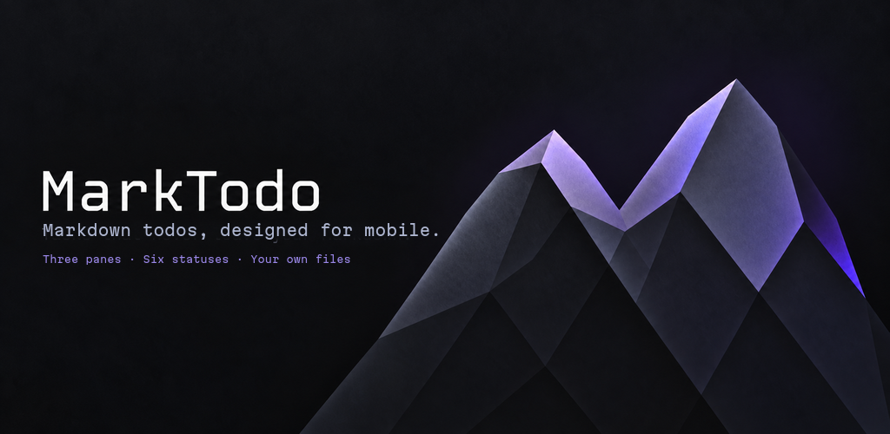
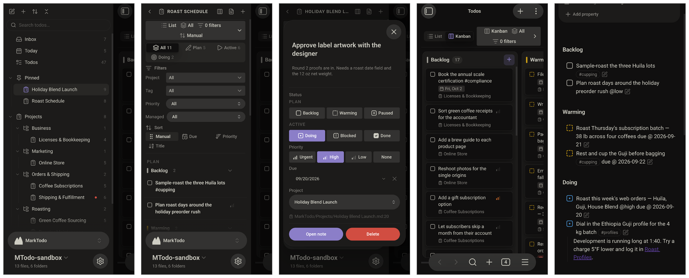
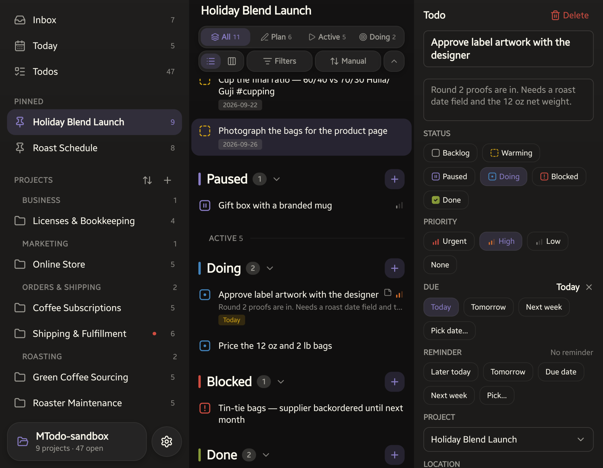
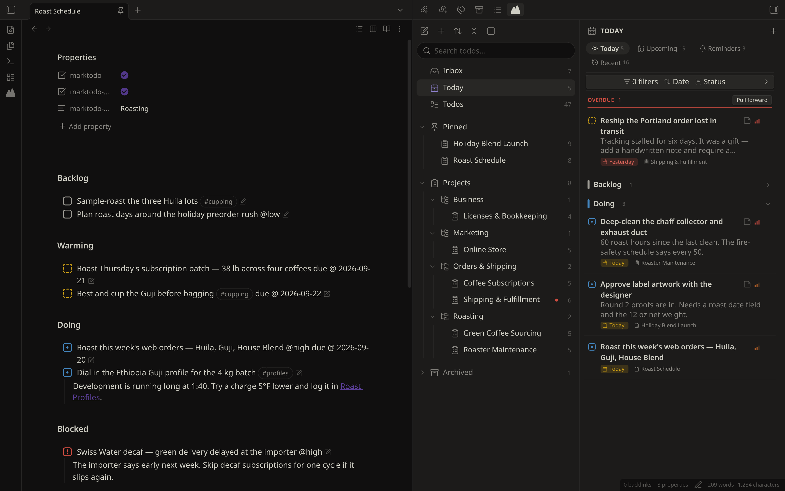
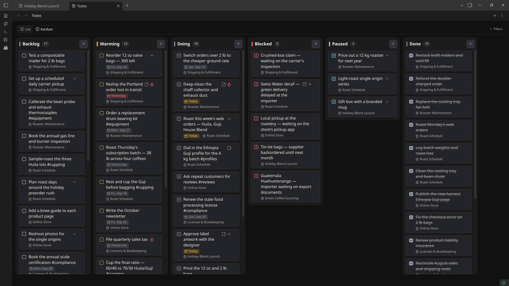
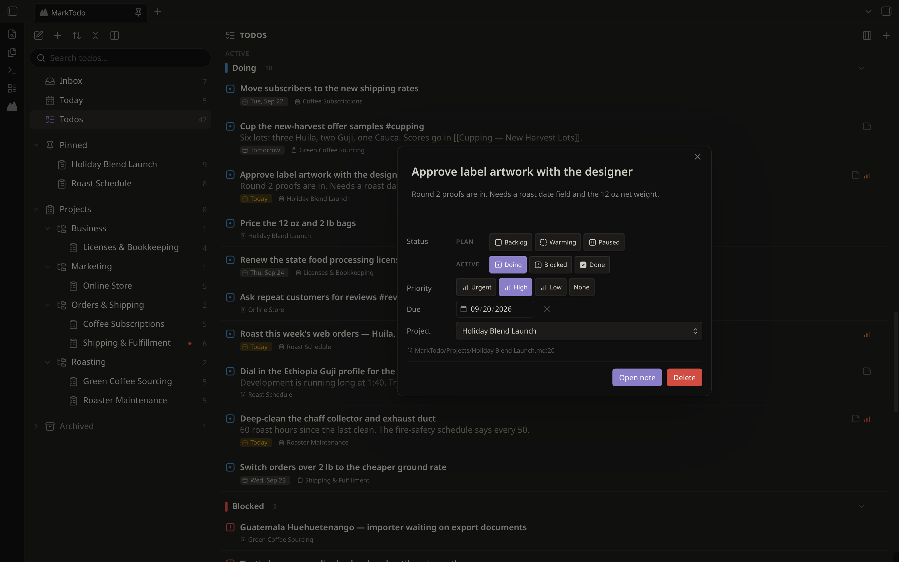

[marktodo.com](https://marktodo.com)

MarkTodo keeps your todos as plain checkboxes in the notes you already keep: an
Obsidian plugin, and a standalone Android app over the same `.md` files.

MarkTodo comes out of a long frustration with the lack of native todo management
in Obsidian, and with the other popular plugins being just too heavy and too much
of a deviation from the .md syntax. Happy they exist, and plenty of people use
them. This is just something different, for anyone who has tried just about every
non-Obsidian tool (Todoist, for example) and had given up, and for whom cutting
and pasting the todos in Obsidian by hand was getting unmanageable.

Most of the current todo plugins are one of two things: either 1. too complicated
and heavy, and deviating from true Markdown (the litmus test being, if you remove
the plugin do your todos return to normal Markdown boxes?), or 2. a janky,
complicated mobile UI, which is so important these days, as we live in a mobile
world.

Last thing: three additional statuses, along with new verbiage for the default
three, augment the .md syntax. Together they make this system the right balance,
without being too basic (native Obsidian) or too complicated.

```
[ ]  Backlog
[>]  Warming
[-]  Paused
[/]  Doing
[!]  Blocked
[x]  Done
```

**Warming** doesn't exist in any other tool. It is the decision that something is
next, made once and written into the file instead of faked with a tag or a due
date. **Blocked** and **Paused** stay separate, because "someone else stopped
this" and "I stopped this" are not the same thing, and every tool that collapses
them into one "on hold" loses the only distinction that matters.

The first three are the ones you plan with; the last three mean work is live.
Every list and board runs in that order, headed **Plan** and **Active**, and one
row of segments narrows any view to a phase, or to Doing alone, when all you want
on screen is what you are actually working on.

The plugin itself, running in full on a phone:



## What's different

**A todo is a line, not a note.** Nearly everything that manages todos in
Obsidian assumes an item is its own note, Bases and the plugins built around it
included. "Reorder 12 oz valve bags" does not need a note. Here a todo is one
checkbox line in a note you already have: a project is any note with
`marktodo: true` in its frontmatter, and its todos are the checkboxes inside it,
so a Green Coffee Sourcing note holds "Sample-roast the three Huila lots" and the
rest. Todos that belong to no project are loose todos: they stay in whatever note
you wrote them in, and the Inbox gathers them into one view.

**No database.** Your Markdown is the whole store. Lists, boards and the
dashboard are views rendered from the notes, not from an index kept on the side,
and anything that outlives a restart is written into the note. The one part that
looks like a database is the id on a managed todo, and it is an ordinary HTML
comment at the end of the line:

```markdown
- [ ] Reorder 12 oz valve bags @high <!-- mt id=aB3xK9Qz -->
```

Nothing renders it: Live Preview hides it, Reading view ignores it as the comment
it is, and any other Markdown app shows a checkbox with its text. Remove
MarkTodo and that line is still a todo, just without the statuses and dates
built on top of it.

**A real standalone Android app.** Almost every todo plugin for Obsidian is a
plugin and nothing else. The handful with a mobile story are just the desktop
plugin shrunk onto a phone: all sidebars, dense panels and hover menus.
MarkTodo's app is a real app in its own right, built for the phone it runs on,
reading and writing the same `.md` files under the same grammar. **And three
panes that slide instead of stacking.** Your projects, your list, and the todo
you're in sit side by side and slide. The list never disappears, and you never
press Back to work out where you are.



That is one screen, not three. Pick a project on the left and the middle updates;
open a todo and the editor slides in beside the list rather than over it. On a
phone the panes are one swipe apart, so the same layout works with one thumb.
Everything in that shot is plain Markdown in an Obsidian vault, read and written
under the same grammar this plugin uses.

The app is in closed testing on
[Google Play](https://play.google.com/store/apps/details?id=com.marktodo.app).

## The format

The checkbox glyph is the canonical status:

| Glyph | Status | Section heading |
|-------|--------|-----------------|
| `[ ]` | Backlog | `## Backlog` |
| `[>]` | Warming | `## Warming` |
| `[-]` | Paused | `## Paused` |
| `[/]` | Doing | `## Doing` |
| `[!]` | Blocked | `## Blocked` |
| `[x]` | Done | `## Done` |

Everything else is optional, inline text appended to the todo:

- `due @ 2026-09-20` sets a due date
- `done @ 2026-09-17 14:30` is set automatically when a todo is marked done,
  down to the minute, and removed when it leaves Done
- `notify @ 2026-09-19 09:00` sets a reminder
- `@urgent`, `@high`, `@low` set inline priority, one of three (aliases
  `@pu`, `@ph`, `@pl`)

Dates are normalized on save (`due @ 2026-9-1` becomes `due @ 2026-09-01`),
and every write is round-trip safe: a todo's surrounding text is never
touched, and a write aborts rather than risk dropping a todo.

## Projects

A todo is meant to end up in a project. Any todo not filed under one shows up in
the Inbox, which is a view, not a note, so there's nothing to create or clean
up. Projects, in-progress work, priorities and due dates are all just
different views over the same Markdown.





## Narrowing a view

Every list and board carries one collapsible bar, and collapsed it still says
what it is doing: `List | All | 0 filters | Manual | Status`. A control that
hides itself leaves you guessing why a list is short.

- **Phase segments** (All, Plan, Active, Doing) narrow any view to a phase,
  or to Doing alone when all you want on screen is what you are working on.
- **Filters** by project, tag, priority, or whether a todo is managed.
- **Sort** within each status: Manual, Due, Priority or Title. Manual means
  file order and is the only sort a drag can write back, so choosing another
  turns drag-to-reorder off rather than writing an order nothing on screen
  reflects.
- **Group** Agenda's segments by date, project, priority or status.

**Agenda** leads with whatever is overdue, in a band of its own, whatever the
sort or grouping, with **Pull forward** to move those todos to today. It is
what is late plus what is due now, which is why it is not called Today. Its three
segments (Agenda, Upcoming, Reminders) each remember their own sort, grouping
and folds, because they are three different questions.

**Done** is always most-recently-completed first, whatever sort is set, because
every other order over finished work answers a question nobody asks. For the
same reason, a Done row can't be dragged to reorder. Every section stops at 20 rows
with a **Show 20 more** button; the heading still counts the whole section.

A project is **pinned** with `marktodo-pinned: true` in its note, which lifts it
to the top of the dashboard. Because the pin lives in the note, it crosses to
the app and survives a rename.

## Appearance

MarkTodo follows your Obsidian theme. Backgrounds, text and borders are your
theme's, in whatever light or dark you run. There is no MarkTodo theme to switch
to, and nothing to fall out of step with the vault around it.

Two things are MarkTodo's own. **The six status colours are fixed** (Backlog
neutral, Warming yellow, Doing blue, Blocked red, Paused purple, Done green),
because a status should mean one thing in every vault and look the same in every
vault too. And **one accent**, which colours selection, links and buttons inside
MarkTodo's panes: any Flexoki hue, or Obsidian's own.

### Why Flexoki

[Flexoki](https://stephango.com/flexoki) is an inky palette by Steph Ango,
Obsidian's own CEO, drawn from analog inks and warm shades of paper, and it is
built for exactly the job six status colours have to do. Its own goal is to be
"calibrated for legibility and perceptual balance across devices", which is the
difference between a palette that looks good on a swatch and one you can read
all day.

That matters here because these colours are not decoration. A status glyph is a
small mark you scan past hundreds of times, so the palette has to stay quiet:
Flexoki's hues are muted and slightly warm rather than saturated, and six of
them can share a list without any one shouting over the others. Each hue is
also a full ramp with a step chosen for light backgrounds and another for dark,
so a status stays legible on paper-white and on true black without being tuned
twice. MarkTodo takes Flexoki's 600 in light and 400 in dark, exactly as that
palette prescribes for coloured text.

The dashboard opens in the left sidebar by default; Settings offers the right
sidebar, a pane at the left of the main area, or the main area itself. Text
size is a multiplier on your theme's sizes, so your theme and zoom still decide
the baseline.

## Making todos

A plain checkbox is already a todo. A **managed** todo also carries a hidden
`<!-- mt id=… -->` comment, the **capsule**, so MarkTodo can track it through
edits and moves and give it any of the six statuses.

- **Type `mtodo`** at the end of any line, after a space (`Buy milk mtodo`).
  A pop-up offers **Create todo here** (Enter picks it), **Open todo editor**
  and, if you set a catch-all note, **Send to catch-all note**. A plain line or
  list item becomes a managed todo; an existing checkbox keeps its status.
  Change the trigger in Settings → Inline todo trigger.
- **Commands** (Command palette):
  - **Convert current line to managed todo**
  - **Adopt all todos in current note**: manages every plain checkbox in it
  - **Insert managed todo at cursor**
  - **Edit todo at cursor**, also in the editor's right-click menu
  - **Add todo…** opens the todo editor
  - **Send current line to catch-all note**
  - **Create project…** and **Convert note to project**
  - **Open dashboard**, **Show agenda**, **Show todos**, **Show inbox**
  - **Open todos as a Kanban board**, **Toggle one or two dashboard columns**
  - **Move completed todos to bottom (current note)**

MarkTodo sets no default hotkeys, so it never clashes with yours. Assign any of
these in Settings → Hotkeys.



## The plugin on a phone or tablet

On phones and tablets MarkTodo starts in **Lightweight mode**: managed
checkboxes, the todo trigger and archive filing keep working, while the dashboard
and boards are off so Obsidian stays quick. To run the full plugin on a device,
go to Settings → MarkTodo → On this device. That is the plugin in the phone
screens above. Boards stay usable there: turn on Settings → Enable kanban drag on
mobile to move cards between columns with a thumb.

While Lightweight mode is on, opening the dashboard points you at the Android app
instead, as does a pop-up the first time. Settings keeps a link to it too.

## Privacy

- **It reads your notes.** To find todos and projects, MarkTodo goes through
  every Markdown note in the vault. Folders listed under Settings → Excluded
  folders are skipped when it looks for todos.
- **It edits notes in response to you**: the todos you change, the projects
  you create, and the upkeep you turn on in Settings (keeping a project's
  status sections in step with its checkboxes, filing archived projects into
  the Archive folder). Changes that touch many notes, like moving the MarkTodo
  folder, ask first.
- **No network.** No accounts, telemetry or network requests. The Contact and
  Google Play buttons open links in your browser.

## Status

Early beta (0.0.14), available in
[Community Plugins](https://community.obsidian.md/plugins/marktodo).

## Development

```bash
pnpm install
pnpm dev     # watch build
pnpm build   # production build (type-checks first)
pnpm test    # unit tests
pnpm check   # TypeScript
pnpm lint    # Obsidian's community-plugin review rules
```

To release, bump the version in `manifest.json`, `package.json` and
`versions.json`, then push a tag with the bare version (`0.0.14`). The Release
workflow builds, attests and publishes `main.js`, `manifest.json` and
`styles.css`.

See [CONTRIBUTING.md](CONTRIBUTING.md) before opening a pull request.

## License

[GNU General Public License, version 3 or later](LICENSE).
